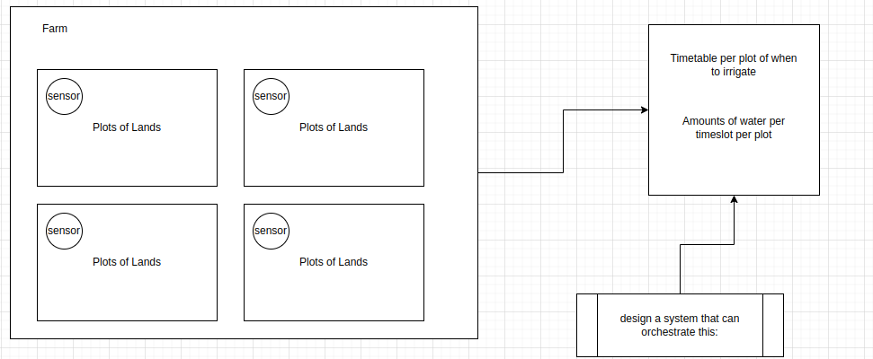
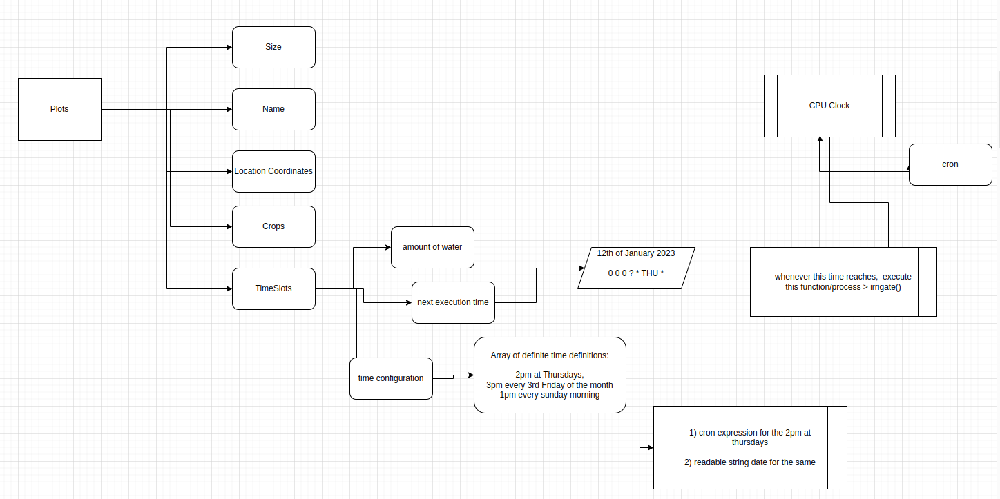
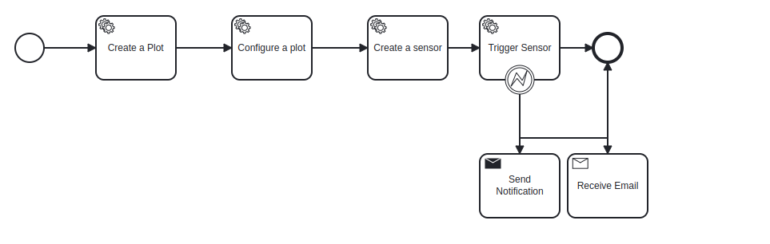
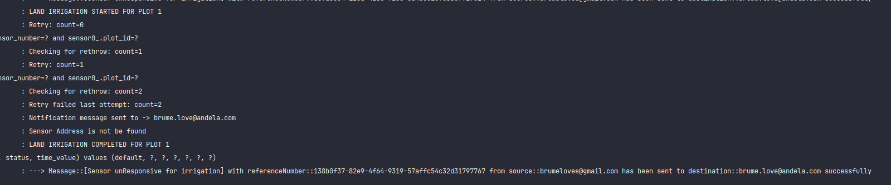

# irrigation-system

Build project by running mvn clean install.

Swagger Link : http://localhost:8092/irrigation-system/swagger-ui/index.html#/  
Cammunda Link: http://localhost:8092/irrigation-system/camunda/app/cockpit/default/#/process-definition/  
Database Link: http://localhost:8092/irrigation-system/h2-ui/

The Image above shows an overview of the automatic irrigation system.Each plot of land has a sensor attached to it. A
farm land can have multiple plots of land. Each plot of land has a time slots for irrigation.

The Image above shows a high level design of the architecture. A plot of land has its size in meters, the crop name,
type(important for prediction), location and so forth.
For the timeslots we need to know the amount of water needed for irrigation as well as the time, frequency, day it needs
to be irrigated.
A sensor unique to a plot of land needs to be created, this sensor will take in the sensorNumber and addressUrl;

After creating a plot of land, the land needs to be configured. create a sensor and a time slot for the complete
configuration.
On configuration the time is converted into a cron expression which is registered as a future job in the linux cpu.
When the time reaches and the scheduler is fired it checks that the sensorNumber exists and takes the waterVolume value
and send it to the sensorAddressUrl via reactive webflux.
In a system with a high write, I would consider making use of a Quartz scheduler.

A sample TimeSLots.Json is found in the resources directory.

Image above shows a rough workflow design of the process. Due to time constraint I am unable to fully implement the
service tasks.

Image shows retry injected 2 times and on recover sends a notification to a message queue in which the email service
listener picks it up and send an email to the correspondence. Spring Retry template was used for retrying erros. The max
attempt is 2 with 1 second in between those attempts. I could also make use of rabbitMQ retry listener if i am concerned
about the expensiveness of calling the retries on the same thread as the scheduler.

Things I can do to improve the system;
Not allow Sensor to irrigate on rainy days(depending on the rain-to-water ratio)   
Use a quartz scheduler (catering for different threads)     
Use Resilience4j or Spring Retryable and Recover        
Do a ping to the sensor before sending a http call to the device, that way if the device doesn't respond we can tell if the sensor address exists and can accept requests. 
